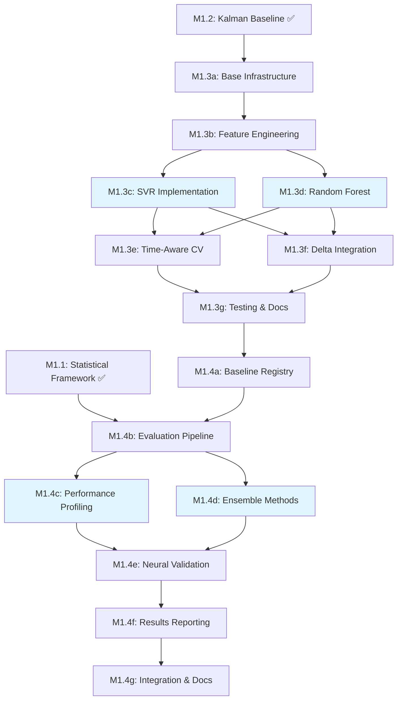

# M1.3 and M1.4 Task Breakdown with DAG Structure

## Executive Summary

This document provides a detailed task breakdown for **M1.3: Classical ML Baselines** and **M1.4: Baseline Suite Integration & Validation** (proposed), including subtask dependencies and a Directed Acyclic Graph (DAG) structure for efficient parallel execution.

## Current Status

### Completed (Specifications):
- ✅ **M1.1**: Statistical Validation Framework - Full specification document created
- ✅ **M1.2**: Kalman Filter Baseline - Complete implementation specification

### Next Tasks:
- **M1.3**: Classical ML Baselines (SVR/RF with time-aware CV)
- **M1.4**: Baseline Suite Integration & Validation (proposed)

---

# M1.3: Classical ML Baselines (3-4 days)

## Overview
Implement Support Vector Regression (SVR) and Random Forest (RF) baselines with proper time-aware cross-validation to establish classical ML performance benchmarks.

## Subtask Breakdown

### M1.3a: Base Infrastructure Setup
**Duration**: 2 hours | **Dependencies**: M1.2 complete
```python
Tasks:
1. Create src/baselines/classical/ directory structure
2. Implement ClassicalMLBaseline protocol extending TrajectoryBaseline
3. Set up feature engineering pipeline for tabular representation
4. Create time-aware data splitting utilities
```

### M1.3b: Feature Engineering Pipeline
**Duration**: 3 hours | **Dependencies**: M1.3a
```python
Features to extract:
1. Kinematic features (SOG, COG, acceleration, turn rate)
2. Temporal features (hour of day, day of week, season)
3. Spatial features (distance to port, water depth if available)
4. Historical features (rolling statistics over past N timesteps)
5. Interaction features (vessel density, relative positions)
```

### M1.3c: SVR Implementation
**Duration**: 4 hours | **Dependencies**: M1.3b
```python
Components:
1. SVRBaseline class with sklearn.svm.SVR
2. Multi-output regression for (Δlat, Δlon, Δsog, Δcog)
3. Hyperparameter tuning with GridSearchCV
4. Time-aware cross-validation with TimeSeriesSplit
5. Integration with StandardScaler pipeline
```

### M1.3d: Random Forest Implementation
**Duration**: 4 hours | **Dependencies**: M1.3b
```python
Components:
1. RFBaseline class with sklearn.ensemble.RandomForestRegressor
2. Feature importance extraction and analysis
3. Out-of-bag error estimation
4. Parallel tree training optimization
5. Tree depth and ensemble size optimization
```

### M1.3e: Time-Aware Cross-Validation
**Duration**: 3 hours | **Dependencies**: M1.3c, M1.3d
```python
Components:
1. Implementation of purged cross-validation
2. Gap parameter to prevent data leakage
3. Vessel-based GroupKFold integration
4. Walk-forward validation for time series
5. Combinatorial purged CV for robust evaluation
```

### M1.3f: Delta Prediction Integration
**Duration**: 2 hours | **Dependencies**: M1.3c, M1.3d
```python
Tasks:
1. Implement delta prediction (predict changes rather than absolutes)
2. Create integration function for cumulative predictions
3. Handle coordinate system transformations
4. Implement constraints for maritime physics
```

### M1.3g: Testing & Documentation
**Duration**: 3 hours | **Dependencies**: M1.3e, M1.3f
```python
Tests:
1. Unit tests for feature engineering
2. Integration tests with synthetic trajectories
3. Performance benchmarks vs neural baselines
4. Documentation with usage examples
```

---

# M1.4: Baseline Suite Integration & Validation (Proposed, 2-3 days)

## Overview
Integrate all baseline models (Statistical, Kalman, Classical ML) into a unified evaluation framework and validate against existing neural models.

## Subtask Breakdown

### M1.4a: Unified Baseline Registry
**Duration**: 2 hours | **Dependencies**: M1.3 complete
```python
Tasks:
1. Create BaselineRegistry for model management
2. Implement factory pattern for baseline instantiation
3. Standardize model interfaces across all baselines
4. Create configuration management system
```

### M1.4b: Comprehensive Evaluation Pipeline
**Duration**: 4 hours | **Dependencies**: M1.4a, M1.1
```python
Components:
1. Integrate with evalx statistical framework
2. Implement batched evaluation for efficiency
3. Create maritime-specific metrics computation
4. Generate confidence intervals for all baselines
5. Implement pairwise statistical comparisons
```

### M1.4c: Performance Profiling
**Duration**: 3 hours | **Dependencies**: M1.4b
```python
Metrics to profile:
1. Inference time per trajectory
2. Memory usage during prediction
3. Training time comparison
4. Scalability with dataset size
5. GPU vs CPU performance (where applicable)
```

### M1.4d: Cross-Baseline Ensemble
**Duration**: 4 hours | **Dependencies**: M1.4b
```python
Tasks:
1. Implement baseline ensemble methods
2. Weighted averaging based on validation performance
3. Stacking with meta-learner
4. Dynamic model selection based on context
5. Uncertainty aggregation across models
```

### M1.4e: Validation Against Neural Models
**Duration**: 4 hours | **Dependencies**: M1.4c, M1.4d
```python
Comparisons:
1. Baseline vs LSTM performance
2. Baseline vs Transformer models
3. Computational efficiency analysis
4. Error distribution comparison
5. Failure case analysis
```

### M1.4f: Results Reporting
**Duration**: 3 hours | **Dependencies**: M1.4e
```python
Deliverables:
1. Comprehensive performance tables
2. Statistical significance testing results
3. Visualization of trajectory predictions
4. Horizon curves for all baselines
5. LaTeX-ready tables for publication
```

### M1.4g: Integration Tests & Documentation
**Duration**: 2 hours | **Dependencies**: M1.4f
```python
Final tasks:
1. End-to-end integration tests
2. Update main README with baseline usage
3. Create jupyter notebook with examples
4. Document best practices for baseline selection
```

---

# Task Dependency DAG

## DAG Visualization



## Critical Path Analysis

### Critical Path (Sequential Tasks)
```
M1.2 → M1.3a → M1.3b → M1.3c/d → M1.3e → M1.3f → M1.3g →
M1.4a → M1.4b → M1.4c/d → M1.4e → M1.4f → M1.4g
```

**Total Duration**: ~5-7 days with parallelization

### Parallelization Opportunities

#### Phase 1: M1.3 Classical ML (Day 1-3)
- **Parallel Group 1**: M1.3c (SVR) and M1.3d (RF) can run in parallel after M1.3b
- **Time Savings**: 4 hours (running both simultaneously)

#### Phase 2: M1.4 Integration (Day 3-5)
- **Parallel Group 2**: M1.4c (Profiling) and M1.4d (Ensemble) can run in parallel after M1.4b
- **Time Savings**: 3-4 hours

---

# Implementation Priority and Strategy

## Priority Order

### High Priority (Critical Path)
1. **M1.3a-b**: Infrastructure and features (enables everything else)
2. **M1.3c or M1.3d**: At least one classical model for comparison
3. **M1.4b**: Evaluation pipeline (needed for all comparisons)
4. **M1.4e**: Validation against neural models (key deliverable)

### Medium Priority (Important but flexible)
1. **M1.3e**: Time-aware CV (can use simple split initially)
2. **M1.4d**: Ensemble methods (nice to have, not critical)
3. **M1.4c**: Performance profiling (can be done later)

### Lower Priority (Can be deferred)
1. **M1.3f**: Delta prediction (optimization)
2. **M1.4f-g**: Reporting and documentation (can be iterative)

## Resource Allocation Strategy

### Single Developer
Execute tasks sequentially following critical path, skip M1.4d initially

### Two Developers
- **Dev 1**: M1.3a → M1.3b → M1.3c → M1.3e
- **Dev 2**: (wait) → M1.3b → M1.3d → M1.3f
- **Both**: Collaborate on M1.4

### Recommended Approach
1. Complete M1.3a-b first (foundation)
2. Implement either SVR or RF (not both initially)
3. Basic evaluation pipeline (M1.4b)
4. Quick validation against one neural model
5. Iterate to add remaining features

---

# Risk Assessment and Mitigation

## Technical Risks

### Risk 1: Feature Engineering Complexity
- **Risk**: Maritime features may be complex to engineer
- **Mitigation**: Start with simple kinematic features, add complexity iteratively

### Risk 2: Time Series Leakage
- **Risk**: Data leakage in cross-validation
- **Mitigation**: Implement proper purged CV with gap parameter

### Risk 3: Scalability Issues
- **Risk**: Classical ML may not scale to large datasets
- **Mitigation**: Implement chunked processing and feature selection

### Risk 4: Integration Conflicts
- **Risk**: Baseline interfaces may not align perfectly
- **Mitigation**: Define clear protocol early, use adapter pattern if needed

## Dependencies Risks

### Risk 1: M1.1 Statistical Framework Changes
- **Impact**: M1.4b depends on evalx framework
- **Mitigation**: Define stable API early, version interfaces

### Risk 2: Dataset Format Changes
- **Impact**: Feature engineering assumptions
- **Mitigation**: Abstract data access through interfaces

---

# Success Metrics

## M1.3 Success Criteria
- [ ] SVR baseline achieves <2km ADE on test set
- [ ] RF baseline provides interpretable feature importance
- [ ] Time-aware CV prevents >5% performance overestimation
- [ ] Both models process 1000 trajectories in <10 seconds

## M1.4 Success Criteria
- [ ] All baselines evaluated with statistical significance testing
- [ ] Performance comparison table with confidence intervals
- [ ] At least one baseline within 20% of neural model performance
- [ ] Complete documentation and examples for all baselines

---

# Next Immediate Actions

Based on the current state (M1.1 and M1.2 specifications complete), the next actions are:

1. **Begin M1.3a**: Set up classical ML infrastructure (2 hours)
2. **Start M1.3b**: Implement feature engineering pipeline (3 hours)
3. **Choose either M1.3c or M1.3d**: Implement one model first for quick validation
4. **Plan code review**: Schedule review after M1.3g completion
5. **Prepare M1.4 integration**: Start planning unified interfaces

## Estimated Timeline

- **Day 1**: M1.3a + M1.3b (infrastructure and features)
- **Day 2**: M1.3c/d + M1.3e (one model + basic CV)
- **Day 3**: M1.3g + M1.4a-b (testing + integration start)
- **Day 4**: M1.4c-e (profiling and validation)
- **Day 5**: M1.4f-g (reporting and documentation)

This provides a clear 5-day sprint to complete the baseline suite with proper validation.
